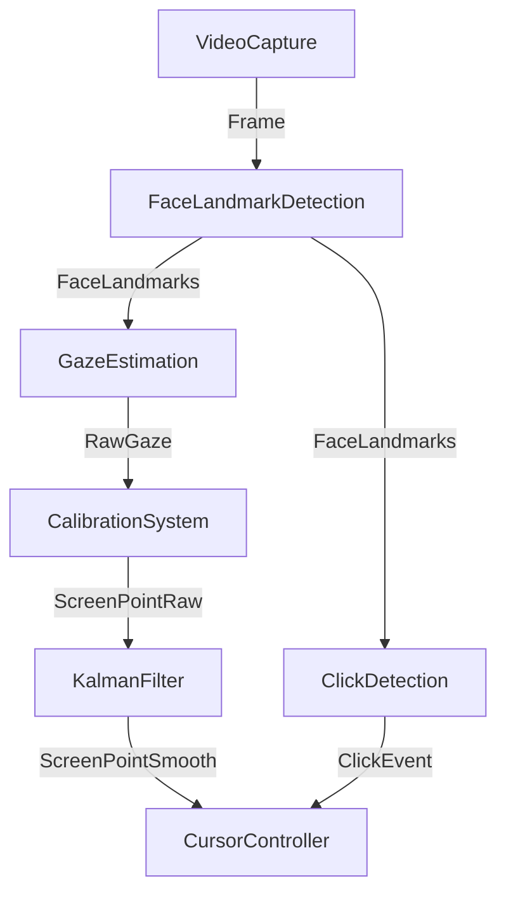

# Eye Cursor App - Architecture

The Eye Cursor App is a modular, event-driven desktop tracking application designed to control the operating system cursor using eye gaze coordinates calculated from a webcam stream.

## System Pipeline Overview

The system operates as a directional processing pipeline where each component performs a single transformation:

## Component Breakdown

### 1. Video Capture (`video_capture`)
* **Purpose**: Fetches real-time imagery from the camera.
* **Mechanism**: Utilizes OpenCV inside a dedicated background thread to ensure non-blocking read access, consistent capture frames, and live FPS tracking.

### 2. Face Landmark Detection (`face_landmark_detection`)
* **Purpose**: Analyzes the image `Frame` to detect facial structures, specifically targeting eyes and facial orientation.

### 3. Gaze Estimation (`gaze_estimation`)
* **Purpose**: Takes landmark coordinates and computes a 3D gaze vector (`RawGaze`) representing where the user is looking.

### 4. Calibration System (`calibration_system`)
* **Purpose**: Maps the 3D gaze vector to specific physical coordinates on the monitor screen (`ScreenPointRaw`).

### 5. Kalman Filter (`kalman_filter`)
* **Purpose**: Filters jitter and tracking noise, outputting stable `ScreenPointSmooth` coordinates.

### 6. Click Detection (`click_detection`)
* **Purpose**: Identifies user click signals (such as blinks, winks, or dwelling on a coordinate) to trigger click actions.

### 7. Cursor Controller (`cursor_controller`)
* **Purpose**: Interfaces with the operating system API to move the mouse cursor and perform click events.

### 8. Persistence Layer (`persistence_layer`)
* **Purpose**: Saves and retrieves user configuration settings and calibration profiles.

### 9. Telemetry (`telemetry`)
* **Purpose**: Collects sub-system latencies and diagnostics to evaluate pipeline efficiency and frame rates.
